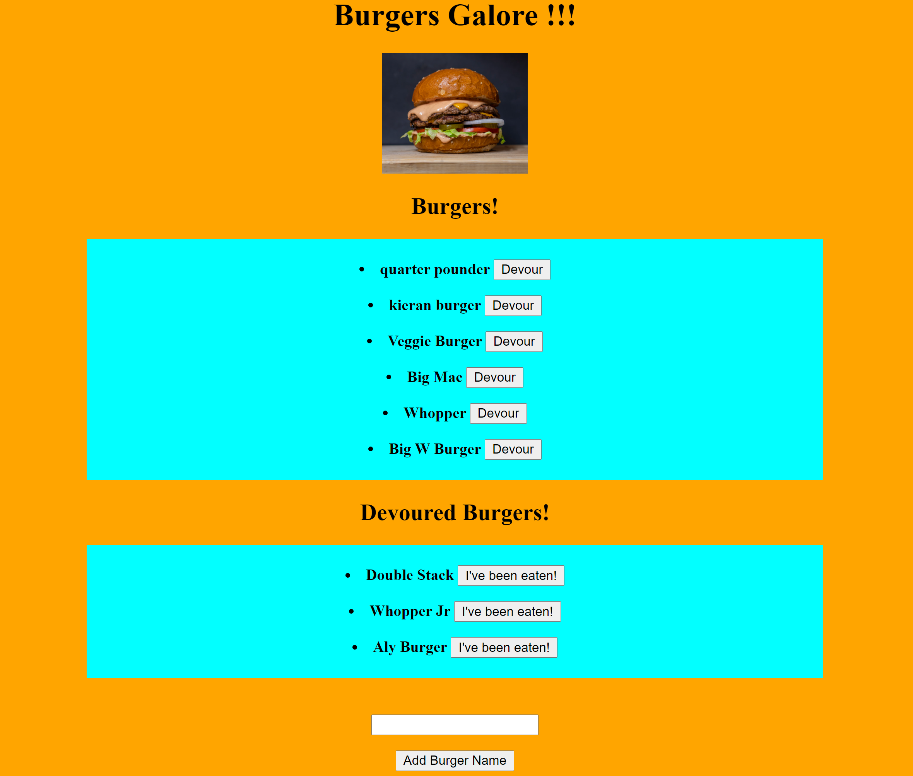

# burger

## Description:
Application that is about eating burgers

## Tools:
* Javascript
* Node.js
* Mysql
* Express
* Express-Handlebars

## User Expierence
The user is presented with a text area to enter a name of a burger. Then the user can click the add burger name button to populate the Burger field. The user can then click the Devour button to send the burger into the Devoured field.

## Image:

## Links:
https://github.com/JosephRhines/burger